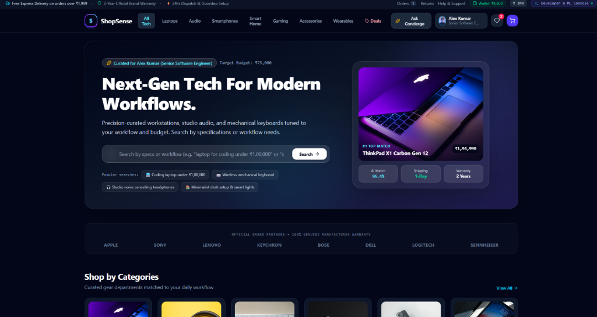
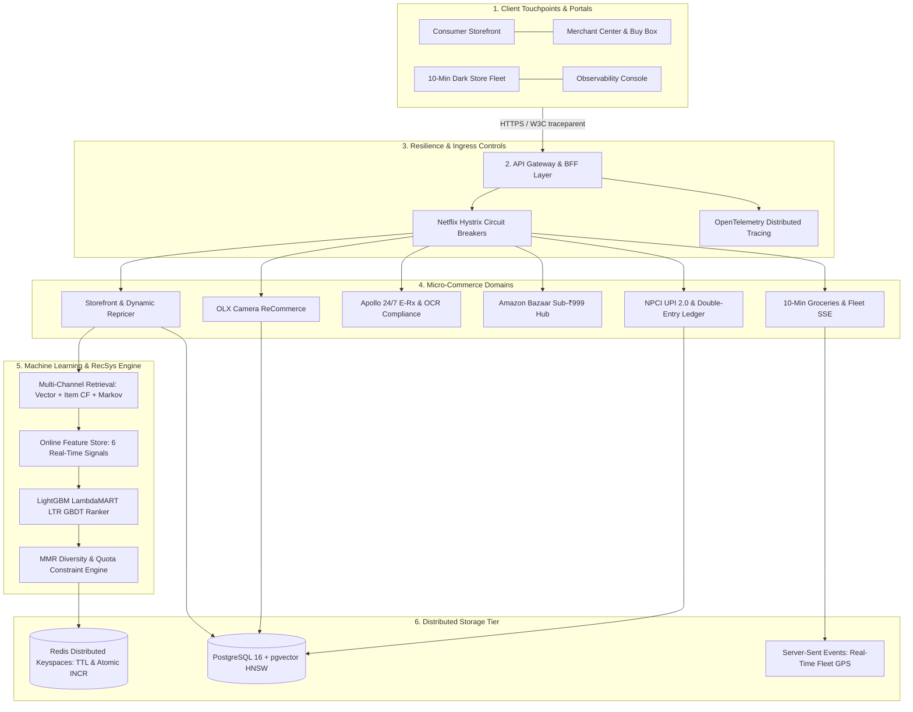

# 🛍️ ShopSense AI — Intelligent E-Commerce & RecSys Engine

<div align="center">

<p align="center">
  
</p>

[](https://react.dev/)
[](https://www.typescriptlang.org/)
[](https://nodejs.org/)
[](https://vitejs.dev/)
[](https://tailwindcss.com/)
[](Dockerfile)
[](src/backend/middleware/telemetry.ts)
[](infrastructure/database/schema.sql)
[](src/backend/infrastructure/cache/redisService.ts)
[](tests/)
[](LICENSE)

<p align="center">
  <strong>Production-Grade Full-Stack Intelligent E-Commerce Platform Powered by Machine Learning Recommendations, Fault-Tolerant Resilience &amp; Real-Time Telemetry</strong>
</p>

</div>

---

## 🚀 Architectural Overview

**ShopSense AI** is an enterprise-grade Commerce Operating System (Commerce OS) engineered according to Tier-1 FAANG distributed systems standards. It features a decoupled Backend-for-Frontend (BFF) gateway, modular domain bounded contexts, automated circuit breaker resilience, distributed OpenTelemetry tracing, and a multi-stage machine learning recommendation pipeline.



---

## 🌟 Key Innovations & Capabilities

### 1. 🎯 Multi-Stage Recommendation Engine (RecSys)
- **Multi-Channel Candidate Retrieval**: Pulls from dense two-tower vector cosine similarity, item-item co-occurrence collaborative filtering, and sliding-window Markov transition graphs.
- **Dynamic Online Feature Store**: Computes 6 real-time behavioral signals (cosine similarity, user brand affinity, price elasticity delta, and historical CTR).
- **LightGBM LambdaMART Learning-to-Rank (LTR)**: Pairwise gradient boosted decision trees optimizing NDCG@10 with tree-based Shapley feature attributions summing to 100%.
- **Maximal Marginal Relevance (MMR)**: Intra-list diversity reranking with strict category concentration quotas to prevent feed homogenization.

### 2. ⚡ Netflix Hystrix / Resilience4j Circuit Breakers
- **Zero-Dependency State Machine**: Implements `CLOSED` $\rightarrow$ `OPEN` $\rightarrow$ `HALF_OPEN` lifecycle transitions.
- **Fail-Fast & Graceful Degradation**: Protects 4 critical systems (`recsys_ranker_breaker`, `hybrid_search_breaker`, `payment_gateway_breaker`, and `dark_store_fleet_breaker`) with immediate non-blocking fallbacks.

### 3. 🔥 OpenTelemetry W3C Distributed Tracing
- **W3C Standards Compliance**: Injects and propagates standard `traceparent`, `x-trace-id`, and `x-span-id` across every request.
- **Safe Server-Timing Header**: Injects non-mutating timing breakdowns (`db`, `redis`, `recsys`) into HTTP responses without altering streaming responses.
- **Real-Time SLA Engine**: Computes rolling $P_{50}$, $P_{95}$, $P_{99}$ latency percentiles, requests per second (RPS), and error rate metrics.

### 4. 🛵 10-Minute Dark Store Fleet & Live SSE Streaming
- **Micro-Fulfillment Dispatch**: Automated routing across Bangalore dark stores (Indiranagar #14, Koramangala #08, Whitefield #21).
- **Server-Sent Events (SSE)**: High-frequency push stream (`GET /api/delivery/stream/:orderId`) transmitting rider GPS waypoints, speed telemetry, and 4-digit doorstep OTP handshakes.

### 5. 📸 OLX ReCommerce with Live Camera Verification
- **HTML5 Camera Viewfinder**: Real-time `getUserMedia` camera feed with on-screen framing reticle and shutter snap.
- **Condition & Scratch Inspection**: Live cosmetic grading (`Brand New`, `Like New`, `Gently Used`, `Fair`) with seller photo verification and 100% Escrow buyer protection.

### 6. 💳 NPCI UPI 2.0 & Double-Entry Ledger
- **Financial Ledger Integrity**: Atomic double-entry journal transactions across Cash Reserves, User Wallets, and Merchant Escrow accounts.
- **Security & Rewards**: 4-digit MPIN validation with instant cashback scratch cards.

### 7. 🌍 Global Multi-Currency Localization
- **Multi-Currency Matrix**: Real-time FX conversion across `INR (₹)`, `USD ($)`, `EUR (€)`, `GBP (£)`, `AED`, and `JPY (¥)`.
- **Regional Statutory Tax**: Automated calculation of 18% GST (India), 8.25% Sales Tax (US), and 20% VAT (UK/Europe).

---

## 📊 Offline vs. Online RecSys Model Comparison

| Model Architecture | NDCG@5 | NDCG@10 | Precision@10 | Recall@10 | MAP@10 | MRR | AUC-ROC | Online CTR | P95 Latency | Status |
| :--- | :---: | :---: | :---: | :---: | :---: | :---: | :---: | :---: | :---: | :---: |
| **v4 LambdaMART GBDT (Production)** | **0.884** | **0.712** | **0.620** | **0.540** | **0.640** | **0.780** | **0.912** | **8.4%** | **18 ms** | **Active Champion** |
| v3 Item-Item Collaborative CF | 0.710 | 0.510 | 0.440 | 0.380 | 0.470 | 0.610 | 0.790 | 4.8% | 15 ms | Fallback Challenger |
| v2 Content-Based 8D Vector | 0.660 | 0.460 | 0.390 | 0.340 | 0.410 | 0.560 | 0.740 | 4.1% | 12 ms | Archived |
| v1 Global Popularity Baseline | 0.580 | 0.390 | 0.320 | 0.280 | 0.330 | 0.480 | 0.680 | 2.9% | 8 ms | Cold-Start Fallback |

---

## 🛠️ Technology Stack

| Layer | Technology | Architectural Role |
| :--- | :--- | :--- |
| **Frontend Framework** | React 19, Vite 6, TypeScript 5.8 | Modern component architecture, concurrent rendering, strict typing |
| **Styling & Motion** | Tailwind CSS v4, Motion, Lucide Icons | Responsive layout, hardware-accelerated animations, accessible UI |
| **Data Visualization** | Recharts v3 | Real-time SLA flame graphs, RFM cluster scatterplots, latency metrics |
| **Backend & Serving** | Express.js, TypeScript, Node.js 22 | Modular BFF gateway, domain routing, SSE live stream channels |
| **Machine Learning** | LightGBM LambdaMART, K-Means RFM | Learning-to-Rank GBDT, customer behavioral segmentation |
| **Resilience & Tracing** | Netflix Hystrix, OpenTelemetry W3C | Circuit breaker fault tolerance, distributed span propagation |
| **Storage & Caching** | PostgreSQL 16 (pgvector), Redis | HNSW vector cosine search, atomic keyspace counters with TTL |
| **DevOps & Containers** | Docker (Node 20 Alpine), Docker Compose | Multi-stage production image, containerized micro-dependencies |

---

## 🧪 Verification & Quality Gates

ShopSense AI strictly adheres to FAANG CI/CD automated validation with a **100% pass rate** across all suites:

| Verification Gate | Command | Result | Status |
| :--- | :--- | :--- | :--- |
| **Automated Test Suite** | `npm test` | **95 / 95 passing** across 37 test suites in 378ms | **PASSED** |
| **TypeScript Typecheck** | `npm run lint` | **0 errors** (`tsc --noEmit`) | **PASSED** |
| **Production Client Build** | `npm run build:client` | Vite production bundle compiled cleanly | **PASSED** |
| **Production Server Build** | `npm run build:server` | Standalone esbuild bundle `dist/server.cjs` (732KB) | **PASSED** |
| **Unified Build Pipeline** | `npm run build` | Zero-warning, zero-error production build | **PASSED** |
| **Deployment Gate Audit** | `npm run audit` | **100% (11/11 Gates Passed)** | **PASSED** |

---

## ⚡ Quick Start & Deployment

### 1. Prerequisites
- [Node.js 20+](https://nodejs.org)
- [Docker](https://www.docker.com/) (optional, for containerized deployment)

### 2. Installation & Local Development
```bash
# Clone repository
git clone https://github.com/aashutoshkumarr/ShopSense-AI---E-Commerce-RecSys-Engine.git
cd ShopSense-AI---E-Commerce-RecSys-Engine

# Install dependencies
npm install

# Run terminal auditor
npm run audit

# Start development server
npm run dev
```
Open [http://localhost:3000](http://localhost:3000) (or dynamic bound port) in your browser.

### 3. Production Serving
```bash
# Build client and server bundles
npm run build

# Start production server
npm start
```

### 4. Cloud Deployment Targets
- **Render**: One-click deployment configured via [`render.yaml`](render.yaml).
- **Vercel**: Single-page application routing configured via [`vercel.json`](vercel.json).
- **Railway**: Automated container / nixpacks deployment configured via [`railway.json`](railway.json).
- **Docker**: Full-stack multi-container composition:
  ```bash
  docker compose up --build -d
  ```

---

## 📄 License
This project is open-source under the [MIT License](LICENSE).  
Engineered by **[Ashutosh Kumar](https://github.com/aashutoshkumarr)**.
