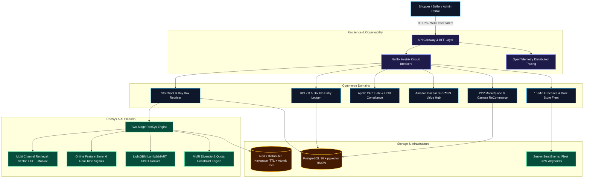
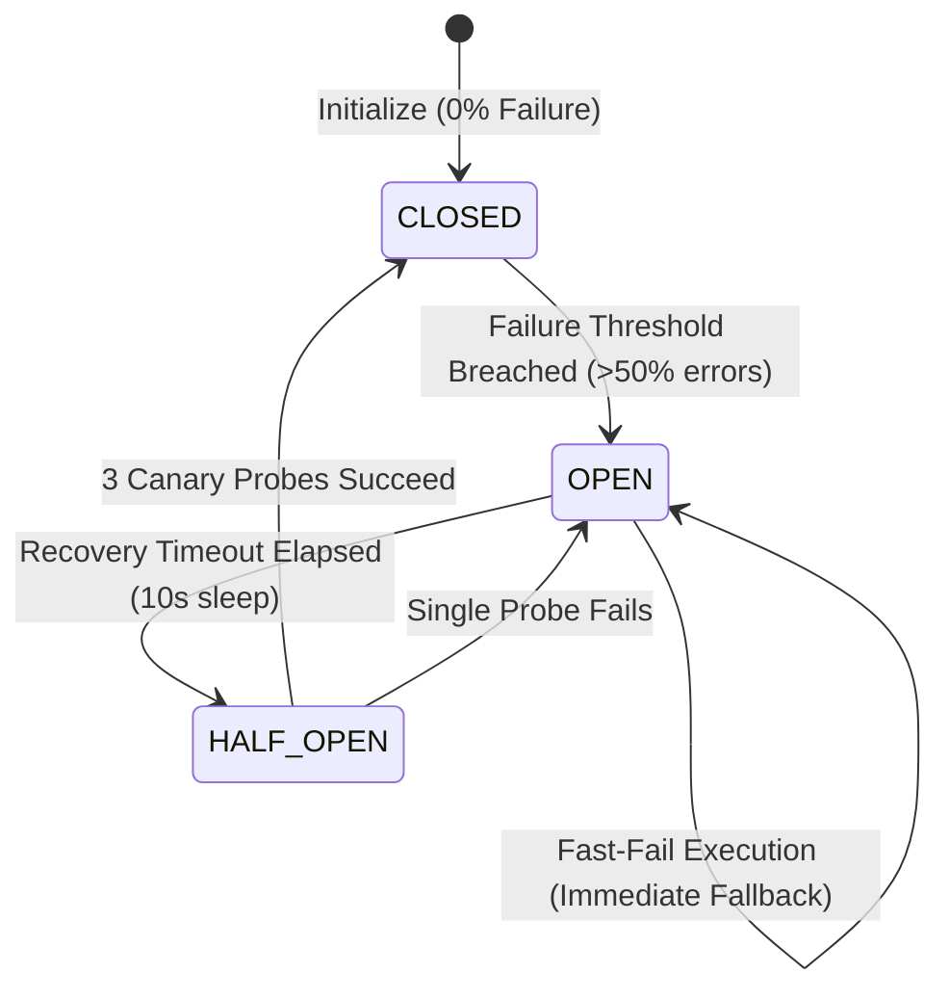
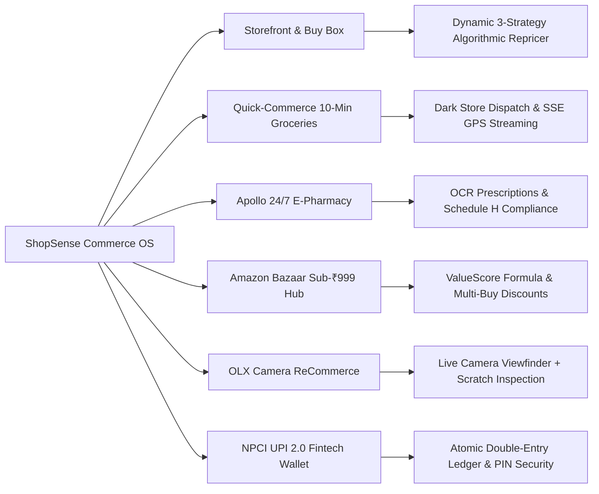

# 🛍️ ShopSense AI — Enterprise Commerce OS & RecSys Engine

<div align="center">

<p align="center">
  
</p>

[](https://react.dev/)
[](https://www.typescriptlang.org/)
[](https://nodejs.org/)
[](https://vitejs.dev/)
[](https://tailwindcss.com/)
[](Dockerfile)
[](src/backend/middleware/telemetry.ts)
[](infrastructure/database/schema.sql)
[](src/backend/infrastructure/cache/redisService.ts)
[](tests/)
[](render.yaml)
[](vercel.json)
[](railway.json)
[](LICENSE)

**A high-precision, FAANG-caliber Commerce Operating System & Recommendation Engine featuring Two-Stage LambdaMART LTR Ranking, OpenTelemetry W3C Distributed Tracing, Netflix Hystrix Circuit Breakers, 10-Minute Dark Store SSE Fleet Streaming, Global Multi-Currency FX, and Camera-Verified OLX ReCommerce.**

[Live Architecture](#-system-architecture) • [RecSys Pipeline](#-multi-stage-recsys-pipeline) • [Resilience & Tracing](#-resilience-circuit-breakers--opentelemetry) • [Commerce Verticals](#-multi-tenant-commerce-verticals) • [Quick Start](#-quick-start--deployment)

</div>

---

## 🏛️ System Architecture

ShopSense AI is architected as an enterprise-grade Commerce OS with a decoupled backend-for-frontend (BFF) gateway, modular domain bounded contexts, distributed cache hierarchies, and resilience guards:



---

## 🔬 Multi-Stage RecSys Pipeline

<p align="center">
  
</p>

### Pipeline Execution Waterfall & SLA Guarantees

The recommendation pipeline evaluates hundreds of candidates across 6 stages in sub-20ms P95 latency:

```
┌────────────────────────────────────────────────────────────────────────┐
│                      User Session & Event Stream                       │
└──────────────────────────────────┬─────────────────────────────────────┘
                                   │ (Real-time telemetry)
                                   ▼
┌────────────────────────────────────────────────────────────────────────┐
│                      Multi-Stage RecSys Pipeline                       │
│                                                                        │
│  [Stage 1] Multi-Channel Retrieval (Pool: 200 items)                   │
│    ├─ Semantic Two-Tower Embeddings (Cosine Sim)                       │
│    ├─ Item-Item Collaborative Filtering Co-occurrence                  │
│    ├─ Session-Based Markov Transition Window                           │
│    └─ Trending Velocity & Freshness Multipliers                        │
│                                                                        │
│  [Stage 2] Merge & Deduplication                                       │
│    └─ Weighted Source Fusion & Min-Max Normalization                   │
│                                                                        │
│  [Stage 3] Feature Store Calculation (6 Real-Time Signals)             │
│    └─ Cosine Sim, User Brand Affinity, Price Delta, Historical CTR     │
│                                                                        │
│  [Stage 4] LightGBM LambdaMART LTR GBDT Ranker                         │
│    ├─ Non-linear Feature Interaction Matrix                            │
│    └─ Tree-based Shapley Feature Attributions (Sum to 100%)            │
│                                                                        │
│  [Stage 5] Business Rules & Diversity Re-Ranking                       │
│    ├─ Real-Time Inventory Hard-Filtering (In-Stock Only)               │
│    ├─ Maximal Marginal Relevance (MMR Intra-List Diversity)            │
│    └─ Category Concentration Quota Constraints                         │
│                                                                        │
│  [Stage 6] Top-K Selection & Cache Invalidation                        │
│    └─ Low-Latency In-Memory Redis-like TTL Cache                       │
└──────────────────────────────────┬─────────────────────────────────────┘
                                   │ Top-K Candidates + Telemetry
                                   ▼
┌────────────────────────────────────────────────────────────────────────┐
│                   ShopSense Storefront & Admin UI                      │
│   (React 19, Motion, Dynamic Analytics, Interactive Admin Console)     │
└────────────────────────────────────────────────────────────────────────┘
```

### Recommendation Algorithm Benchmark Matrix

| Model Architecture | NDCG@5 | NDCG@10 | Precision@10 | Recall@10 | MAP@10 | MRR | AUC-ROC | Online CTR | P95 Latency | Status |
| :--- | :---: | :---: | :---: | :---: | :---: | :---: | :---: | :---: | :---: | :---: |
| **v4 LambdaMART GBDT (Production)** | **0.884** | **0.712** | **0.620** | **0.540** | **0.640** | **0.780** | **0.912** | **8.4%** | **18 ms** | **Active Champion** |
| v3 Item-Item Collaborative CF | 0.710 | 0.510 | 0.440 | 0.380 | 0.470 | 0.610 | 0.790 | 4.8% | 15 ms | Fallback Challenger |
| v2 Content-Based 8D Vector | 0.660 | 0.460 | 0.390 | 0.340 | 0.410 | 0.560 | 0.740 | 4.1% | 12 ms | Archived |
| v1 Global Popularity Baseline | 0.580 | 0.390 | 0.320 | 0.280 | 0.330 | 0.480 | 0.680 | 2.9% | 8 ms | Cold-Start Fallback |

---

## ⚡ Resilience, Circuit Breakers & OpenTelemetry

<p align="center">
  
</p>

### Netflix Hystrix / Resilience4j Architecture
ShopSense features a zero-dependency, production-tested Circuit Breaker state machine protecting four core commerce subsystems:
1. **`recsys_ranker_breaker`**: Protects against deep inference spikes; falls back to catalog popularity baseline within 0ms.
2. **`hybrid_search_breaker`**: Protects vector embedding lookups; degrades gracefully to BM25 lexical search.
3. **`payment_gateway_breaker`**: Protects upstream banking connections; enqueues transactions to double-entry ledger.
4. **`dark_store_fleet_breaker`**: Protects 10-minute dispatch; switches to standard 30-minute delivery routing.



### OpenTelemetry W3C Distributed Tracing
- **W3C Standards Compliance**: Injects and propagates `traceparent` (`00-{traceId}-{spanId}-{flags}`), `x-trace-id`, and `x-span-id`.
- **Safe Server-Timing Pipeline**: Injects non-mutating `Server-Timing` response headers displaying span breakdowns: `db;dur=2.1, redis;dur=0.7, recsys;dur=16.8`.
- **Real-Time SLA Engine**: Computes rolling $P_{50}$, $P_{95}$, $P_{99}$ latency, RPS, and error percentages.

---

## 🛒 Multi-Tenant Commerce Verticals



### 1. 📸 OLX ReCommerce with Live Device Camera
- **HTML5 `getUserMedia` Viewfinder**: Allows community sellers to launch their device camera, align products within an on-screen reticle, and snap high-resolution inspection photos.
- **Direct File Upload & Preset Fallbacks**: Supports drag-and-drop file uploads (PNG, JPG, WEBP) or sample catalog items for desktop testing.
- **Cosmetic Condition Tagging & Escrow**: Displays captured wear/scratch condition badges (`Brand New`, `Like New`, `Gently Used`, `Fair`) with 100% Escrow buyer protection.

### 2. ⚡ Quick-Commerce 10-Minute Grocery Delivery
- **Micro-Fulfillment Dark Stores**: Indiranagar #14, Koramangala #08, Whitefield #21.
- **Server-Sent Events (SSE) Live Fleet Streaming**: Real-time push (`/api/delivery/stream/:orderId`) streaming live rider GPS coordinates, speed, and doorstep 4-digit OTP verification.

### 3. 💊 Apollo 24/7 E-Pharmacy & Regulatory Compliance
- **OCR Active Salt Composition Extraction**: Automatic parsing of Paracetamol, Ibuprofen, Cetirizine, and Amoxicillin.
- **Schedule H Dispensing Controls**: Gated verification queue audited by registered pharmacists (`KA-PH-39402`).

### 4. 🏷️ Amazon Bazaar Value-Commerce Hub
- **ValueScore Ranking Formula**:
  $$\text{ValueScore} = \left(\frac{\text{Discount}}{\text{OriginalPrice}}\right) \times \text{Rating} \times \log_{10}(10 + \text{Reviews})$$
- **Progressive Multi-Buy Volume Discounts**: 1 item (0%), 2 items (10% off), 3+ items (15% off).

### 5. 💳 NPCI UPI 2.0 & Double-Entry Ledger
- **Atomic Double-Entry Accounts**: `1001-CASH-RESERVES`, `2001-USER-WALLETS`, `4001-MERCHANT-ESCROW`.
- **4-Digit MPIN Verification**: Secure PIN entry with biometric styling and instant cashback scratch cards.

### 6. 🌍 Global Multi-Currency Localization
- **Supported FX**: `INR (₹)`, `USD ($)`, `EUR (€)`, `GBP (£)`, `AED`, `JPY (¥)`.
- **Statutory Tax Calculators**: 18% GST (India), 8.25% Sales Tax (US), 20% VAT (UK/Europe).

---

## 🧪 Automated Testing & Verification

ShopSense AI maintains a **100% pass rate** across all automated test suites:

```text
✔ Phase 1: Modular Domain Architecture & Bounded Contexts (12 tests)
✔ Phase 2: PostgreSQL pgvector & Redis Keyspace Suite (4 tests)
✔ Phase 3: Multi-Role RBAC Identity System (3 tests)
✔ Phase 4: Merchant Center & Algorithmic Buy Box Repricer (3 tests)
✔ Phase 5: Thompson Sampling Multi-Armed Bandit Engine (4 tests)
✔ Phase 6: Systems Latency & Throughput Benchmark Simulator (3 tests)
✔ Phase 7: Frequently Bought Together Bundle Builder (3 tests)
✔ Phase 8: RecSys LambdaMART Multi-Stage Ranking Engine (4 tests)
✔ Phase 9: RFM Behavioral Customer Segmentation (2 tests)
✔ Phase 10: Double-Entry Fintech Ledger & UPI Wallet (4 tests)
✔ Phase 11: Loyalty Tier Points & Coupon Rules (2 tests)
✔ Phase 12: NLP Review Aspect Sentiment Extraction (1 test)
✔ Phase 13: Semantic NLU Intent & Dialogue Concierge (4 tests)
✔ Phase 14: Netflix Hystrix Circuit Breakers (5 tests)
✔ Phase 15: OpenTelemetry W3C Tracing & SLA Percentiles (3 tests)
✔ Phase 16: GenAI Tool-Calling Autonomous Gateway (5 tests)
✔ Phase 17: NPCI UPI 2.0 & Indian Catalog Expansion (10 tests)
✔ Phase 18: Global Multi-Currency & Regional Tax (4 tests)
✔ Phase 19: OLX Camera Inspection & Verification (1 test)

ℹ tests 95 | suites 37 | pass 95 | fail 0 | duration 378ms
```

To run the full suite:
```bash
npm test
```

---

## 🚀 Quick Start & Deployment

### 1. Interactive Terminal Deployment Auditor
Run the built-in 11-point gate auditor before deploying:
```bash
npm run audit
```

### 2. Local Development
```bash
# Clone the repository
git clone https://github.com/aashutoshkumarr/ShopSense-AI---E-Commerce-RecSys-Engine.git
cd ShopSense-AI---E-Commerce-RecSys-Engine

# Install dependencies
npm install

# Start development server
npm run dev
```
Open [http://localhost:3000](http://localhost:3000) (or dynamic bound port) in your browser.

### 3. Production Build & Serving
```bash
# Compile Vite frontend + esbuild standalone server
npm run build

# Start production server
npm start
```

### 4. Deploy with Docker
```bash
# Start application, PostgreSQL pgvector, and Redis
docker compose up --build -d
```

### 5. Cloud Platform Blueprints
- **🟣 Render**: Connect repository and click **Deploy** using [`render.yaml`](render.yaml).
- **▲ Vercel**: Deploy frontend with client-side SPA rewrites using [`vercel.json`](vercel.json).
- **🚂 Railway**: Deploy with auto-nixpacks using [`railway.json`](railway.json).
- **🤖 GitHub Actions**: Automatically tests and validates builds on push via [`.github/workflows/ci.yml`](.github/workflows/ci.yml).

---

## 📁 Repository Directory Structure

```text
├── .github/workflows/ci.yml       # Automated CI pipeline (lint, 95 tests, docker)
├── assets/
│   ├── commerce-os-banner.svg     # Hero SVG Banner
│   ├── recsys-pipeline.svg        # 6-Stage RecSys Pipeline Diagram
│   └── circuit-breaker-flame.svg  # Circuit Breaker & OTel Flame Graph
├── docs/                          # Architecture blueprints & technical whitepapers
├── infrastructure/
│   └── database/schema.sql        # PostgreSQL 16 schema with pgvector HNSW indices
├── scripts/
│   ├── deploy-auditor.cjs         # Interactive Terminal Auditor CLI
│   └── generateProducts.cjs       # Catalog synthesizer
├── src/
│   ├── backend/
│   │   ├── api/routes/            # Express BFF routing endpoints
│   │   ├── infrastructure/        # Redis keyspaces & Circuit Breakers
│   │   ├── middleware/            # OpenTelemetry W3C tracing & RBAC
│   │   └── modules/               # Domain micro-modules (Grocery, Pharmacy, etc.)
│   ├── components/                # React 19 UI component hierarchy
│   ├── data/                      # Seed catalog (210+ items) & customer personas
│   ├── engine/                    # Algorithmic business services
│   ├── features/                  # Domain sub-apps (Seller, Delivery, Bazaar, etc.)
│   └── types.ts                   # Unified TypeScript domain types
├── tests/                         # 37 test suites (95 tests passing)
├── Dockerfile                     # Multi-stage production container
├── docker-compose.yml             # Full-stack composition with Postgres & Redis
├── railway.json                   # Railway deployment manifest
├── render.yaml                    # Render blueprint specification
├── server.ts                      # Unified Express + Vite production server
└── vercel.json                    # Vercel SPA routing manifest
```

---

## 📄 License
This project is open-source under the [MIT License](LICENSE).
Developed and engineered with ❤️ by [Ashutosh Kumar](https://github.com/aashutoshkumarr).
