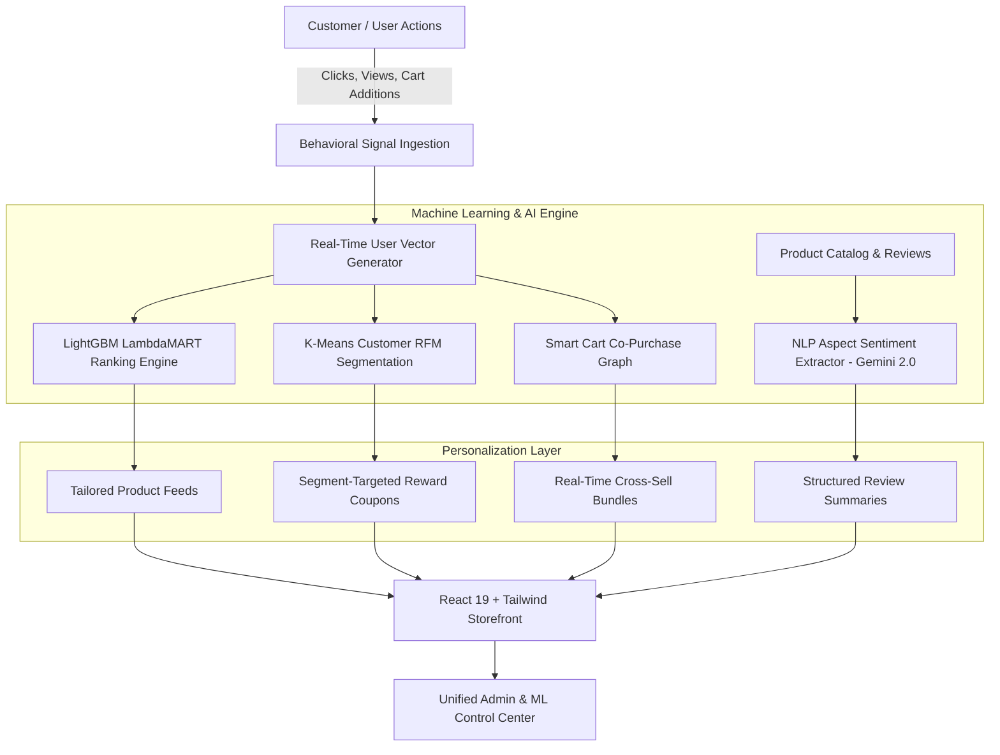

# 🛍️ ShopSense AI — Intelligent E-Commerce & RecSys Engine

<div align="center">

  
  
  
  
  
  

  <p align="center">
    <strong>Production-Grade Full-Stack Intelligent E-Commerce Platform Powered by Machine Learning Recommendations & GenAI</strong>
  </p>

</div>

---

## 🚀 Architectural Overview

**ShopSense AI** is an enterprise-grade, end-to-end intelligent e-commerce ecosystem. It combines cutting-edge machine learning recommendation algorithms (Learning-to-Rank, Collaborative Filtering) with generative AI (Google Gemini) and customer behavioral analytics to deliver hyper-personalized shopping experiences.



---

## 🌟 Key Innovations & Capabilities

### 1. 🎯 Multi-Stage Recommendation Engine (RecSys)
- **LightGBM LambdaMART Learning-to-Rank**: Evaluates historical transaction logs, user affinities, and item characteristics to predict purchase propensity.
- **Collaborative & Content-Based Filtering**: Item-to-item similarity matrices mapped across product metadata and user interactions to resolve cold-start discovery.
- **Smart Cart Co-Purchase Mining**: Analyzes transactional basket association rules to suggest relevant complementary add-ons.

### 2. 🧠 GenAI Review Intelligence (Google Gemini 2.0)
- Deep aspect-based sentiment extraction analyzing customer reviews.
- Generates structured pros/cons, rating breakdowns, and product consensus insights directly on product display pages.

### 3. 👥 Customer Behavioral RFM Segmentation (K-Means)
- Unsupervised clustering segmenting customers based on **Recency, Frequency, and Monetary** metrics.
- Automates segment-targeted promotional discounts and dynamic tier bonuses (Champions, Loyal Customers, At-Risk).

### 4. 💳 Real-Time Wallet & Loyalty Reward Engine
- Automated cashback and reward point calculation per purchase.
- Seamless order lifecycle tracking and state management.

### 5. 📊 Unified ML & Operations Control Center
- Real-time performance dashboards built with **Recharts** visualizing customer cohorts, CTR, conversion rates, and model latency metrics.

---

## 🛠️ Technology Stack

| Layer | Technology |
| :--- | :--- |
| **Frontend Framework** | React 19, Vite 6, TypeScript 5.8 |
| **Styling & UI** | Tailwind CSS v4, Lucide React, Motion (Framer Motion), Canvas-Confetti |
| **Data Visualization** | Recharts v3 |
| **Backend & Serving** | Express.js, TypeScript Node/Bun Runtime |
| **AI & LLM Services** | Google Gemini API (`@google/genai` v2.4) |
| **Bundling & Tooling** | ESBuild, TSX, PostCSS |

---

## ⚡ Quick Start Guide

### Prerequisites
- [Node.js 20+](https://nodejs.org) or [Bun](https://bun.sh)
- Google Gemini API Key

### Installation

```bash
# 1. Clone repository
git clone https://github.com/aashutoshkumarr/ShopSense-AI---E-Commerce-RecSys-Engine.git
cd ShopSense-AI---E-Commerce-RecSys-Engine

# 2. Install dependencies
npm install
# or with bun:
bun install

# 3. Configure environment
cp .env.example .env
# Add your GEMINI_API_KEY to .env

# 4. Start Development Server
npm run dev
# or with bun:
bun dev
```

Visit `http://localhost:3000` to interact with the live storefront and ML Control Center.

---

## 📄 License
This project is open-source under the MIT License. Engineered by [Ashutosh Kumar](https://github.com/aashutoshkumarr).
